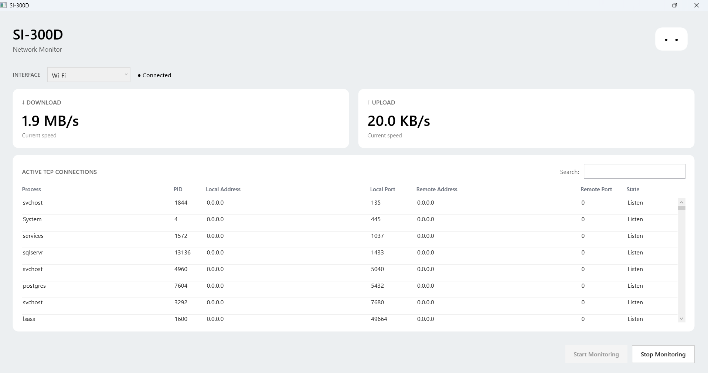
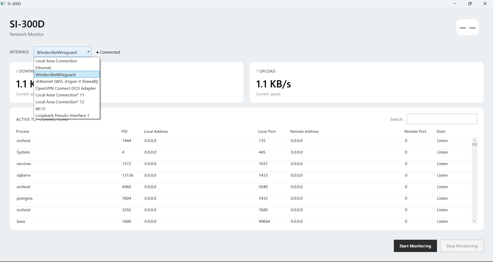

# SI-300D

A lightweight Windows network monitoring dashboard built with **C# and WPF**.

SI-300D provides a simple real-time view of network traffic and active TCP connections, including the processes responsible for those connections.

## Features

- Real-time upload and download speed monitoring
- Network interface selection
- Total network traffic statistics
- Active TCP connection monitoring
- IPv4 and IPv6 support
- Local and remote IP addresses and ports
- TCP connection states
- Process ID and process name association
- Search and filter TCP connections
- Start / stop monitoring
- Clean, responsive WPF dashboard

## Screenshots





## Tech Stack

- **C# / .NET 8**
- **WPF**
- **XAML**
- **MVVM**
- **Windows IP Helper API**
- **P/Invoke**

## How It Works

Network traffic statistics are collected from the selected network interface and sampled continuously to calculate current transfer rates.

TCP connections are retrieved from Windows using the native `GetExtendedTcpTable` API. Process IDs provided by Windows are then resolved to process names where possible.

The application is intentionally lightweight and focused on monitoring rather than deep packet inspection or network security analysis.

## Running the Application

Download the latest release for Windows, extract it, and run:

```text
SI-300D.exe
